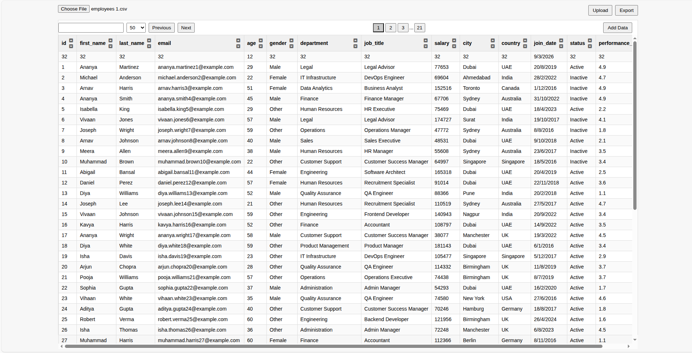
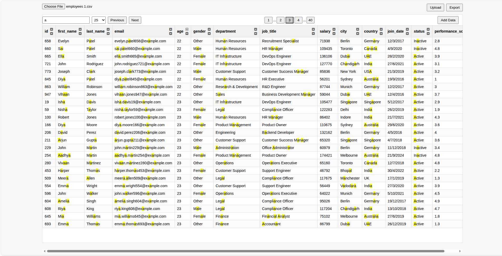
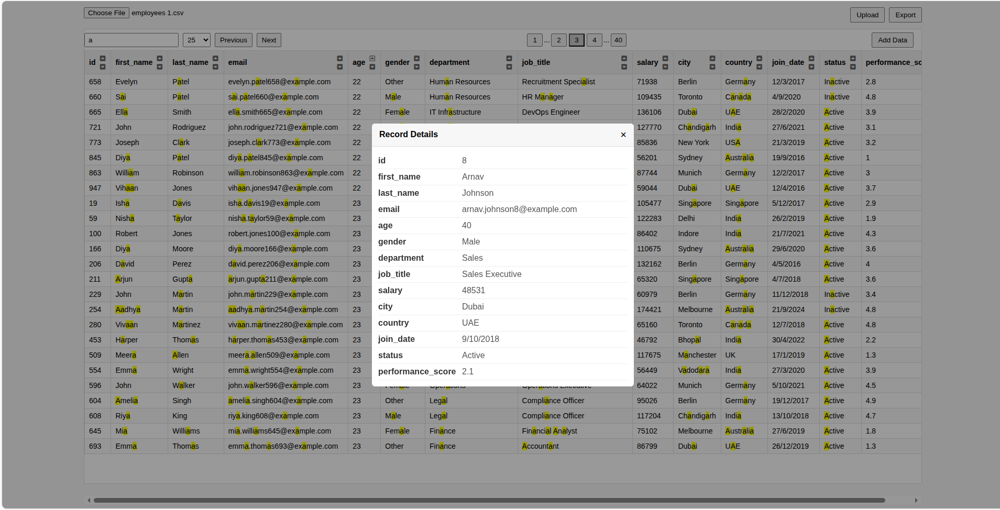

# CSV Data Explorer

A pure JavaScript web application for loading, parsing, and interactively exploring large CSV datasets (1000+ records). Built with vanilla JavaScript, HTML, and CSS, this tool provides advanced data operations including pagination, sorting, filtering, and more.


<br>

### Live Demo

[Link to Live Demo](https://jaimin-dekavadiya-simform.github.io/csv_assessment/)

## Features

### Core Functionality

- **CSV Parsing**: Accepts CSV files via upload, parses data into JSON objects with dynamic type inference
- **Data Display**: Renders data in a responsive HTML table with dynamic headers
- **Pagination**: Navigate through data with customizable page sizes (10, 25, 50, 100, 200 records per page)
- **Sorting**: Click column headers to sort data ascending/descending with visual indicators
- **Global Search**: Real-time search across all columns with debounced input and highlighted results

### Advanced Features

- **Dynamic Data Type Checking**: Automatically infers column data types (number, string, boolean, date) by analyzing the first 20-50 rows and assigning types based on occurrence ratios (>70% threshold)
- **Record Detail View**: Click any row to view full record details in a modal dialog
- **Add New Records**: Form-based interface for adding new data entries with type-aware validation
- **Export Functionality**: Export filtered/search results to CSV format
- **State Persistence**: Saves UI state (pagination, filters, sorting) to localStorage for seamless sessions
- **Error Handling**: Comprehensive error handling for invalid CSV files, malformed data, and user input
- **Search Highlighting**: Optimized text highlighting in search results with pre-computed match indexes
- **Debounced Search**: 200ms debounced search input for smooth performance
- **Robust Pagination**: Maintains current page index when changing page sizes





## Architecture

### Object-Oriented Design

The application follows a clean, modular architecture combining object-oriented and functional programming paradigms:

- **App Class**: Central controller managing application state, DOM interactions, and rendering
- **Handler Modules**: Event-driven handlers for user interactions (file upload, sorting, pagination, etc.)
- **Service Modules**: Functions for core business logic (parsing, filtering, sorting, pagination)
- **Utility Modules**: Helper functions for DOM manipulation, debouncing, and file operations
- **Error Handling**: Custom AppError class for consistent error management

### Key Components

#### State Management

```javascript
{
  pagination: {
    pageNumber: 1,
    offset: 50,
    pages:0,
    persistIndex: 0
  },
  sort: {
    sortBy: undefined,
    sortType: "DEFAULT"
  },
  filter: {
    searchText: "",
    prevSearchText: ""
  },
  data: [], // Raw parsed data
  filteredData: [], // Filtered results
  sortedData: [], // Sorted results
  paginatedData: [], // Current page data
  headings: [] // Column definitions with types
}
```

#### Dynamic Type Inference

The parser analyzes data patterns to automatically assign appropriate JavaScript types:

- **Numbers**: Values matching `/^\d+(\.\d+)?$/`
- **Dates**: Values matching `/\d+-\d+-\d+/`
- **Booleans**: Values matching `/^(true|false)$/i`
- **Strings**: Default fallback

Type assignment requires >70% consistency across sample rows.

#### Optimized Search & Highlighting

- Uses regex matching for case-insensitive global search
- Pre-computes match indexes during filtering for efficient highlighting
- Debounced input prevents excessive re-renders

#### Robust Pagination

Maintains user position by recalculating page numbers when offset changes:

```javascript
const pageNumber = Math.floor(startIndex / newOffset) + 1;
```

## Project Structure

```
csv_assessment/
├── index.html              # Main HTML structure
├── README.md               # This file
├── styles/
│   └── style.css           # Application styling
├── src/
│   ├── main.js             # App class and initialization
│   ├── state.js            # (Empty - state managed in App)
│   ├── error/
│   │   └── appError.js     # Custom error class
│   ├── handlers/           # Event handlers
│   │   ├── addNewRecordHandler.js
│   │   ├── fileExporthandler.js
│   │   ├── fileSubmitHandler.js
│   │   ├── filterButtonHandler.js
│   │   ├── paginationHandler.js
│   │   ├── recordViewhandler.js
│   │   └── sortingButtonHandler.js
│   ├── services/           # Business logic
│   │   ├── filter.js
│   │   ├── loadCsv.js
│   │   ├── localStorage.js
│   │   ├── paginate.js
│   │   ├── parseCsv.js
│   │   └── sort.js
│   └── utils/              # Helper utilities
│       ├── debounce.js
│       ├── domHelpers.js
│       └── downloadFileHelpers.js
├── data/                   # Sample CSV files
│   ├── employees 1.csv
│   ├── modified.csv
│   └── test.csv
└── docs/
    └── assignment.md       # Original assignment requirements
```

## How to Run

1. **Prerequisites**: Modern web browser with ES6+ support
2. **Setup**: No build process required - pure vanilla JavaScript
3. **Launch**: Open `index.html` in your web browser
4. **Usage**:
   - Click "Choose File" to select a CSV file
   - Click "Upload" to parse and display the data
   - Use search bar for real-time filtering
   - Click column headers to sort data
   - Use pagination controls to navigate
   - Click table rows for detailed view
   - Use "Add Data" to insert new records
   - Click "Export" to download filtered results
5. You can uncomment the sleep function inside `src/handlers/fileSubmitHandler.js` to introduce delay and see the loading animation.

## Technical Implementation

### CSV Parsing Algorithm

1. Load file as text using File API
2. Split into rows by newlines
3. Extract headers from first row
4. Sample first 4 rows for type inference
5. Count type occurrences per column
6. Assign types based on majority ratio (>70%)
7. Parse remaining rows with inferred types

### Performance Optimizations

- **Debounced Search**: Prevents excessive filtering on rapid typing
- **Index-Based Highlighting**: Pre-compute match positions for efficient DOM updates
- **Lazy Rendering**: Only render visible page data
- **State Persistence**: Avoid re-parsing on page refresh

### Browser Compatibility

- ES6+ features: Modules, Classes, Arrow functions, Template literals
- File API for upload handling
- localStorage for state persistence
- Modern DOM APIs (querySelector, addEventListener)

## Sample Data

The `data/` directory contains sample CSV files for testing:

- `employees 1.csv`: Employee records with various data types
- `modified.csv`: Modified version for testing updates
- `test.csv`: Smaller test dataset

## Future Enhancements

Potential improvements for the application:

- Column visibility toggles
- Bulk row selection and deletion
- Summary statistics dashboard
- Chart/visualization integration
- Advanced filtering (date ranges, numeric comparisons)
- CSV validation with detailed error reporting
- Drag-and-drop file upload
- Keyboard navigation support

---

_Built with pure JavaScript, HTML, and CSS. No external dependencies required._
